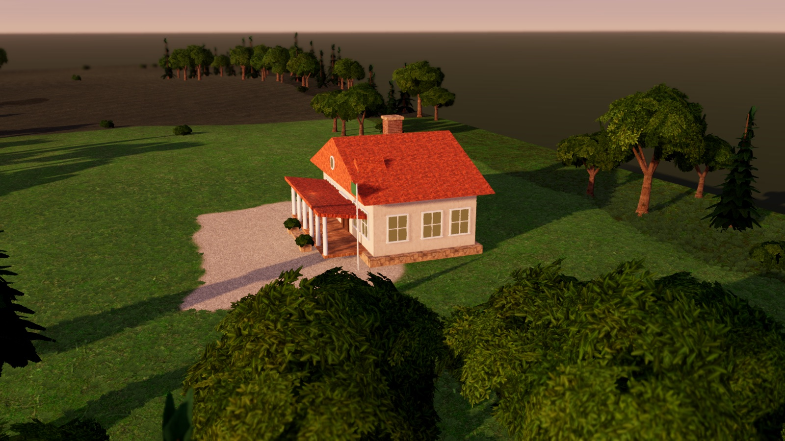
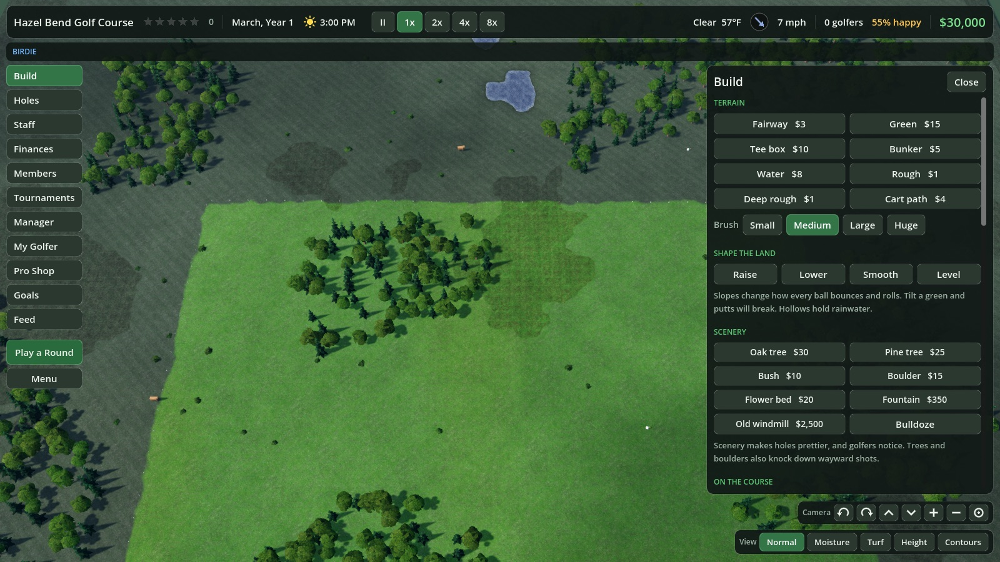

# Par & Parcel

[](https://github.com/linux4life1/par-and-parcel/actions/workflows/ci.yml)

**Build a golf course. Run the club. Play the round.**

Paint fairways, carve greens, shape the land and lay out holes. Golfers
with opinions turn up, play them, and pay you exactly what each hole was
worth to them. Hire the greenkeepers, host the tournament, buy the next
parcel, and when the office gets quiet, take your own clubs out on the
course you built.

A course-builder tycoon in the spirit of the early-2000s classics, made
with Godot 4 for macOS, Windows and Linux, 120 frames a second on real
hardware.


## What you get

- **A sandbox that fights back.** Weeds spread when golfers are unhappy,
  and weeds make golfers unhappy. Gophers dig. Storms roll in. A volcano
  may redesign your back nine.
- **Golfers who pay by the hole.** No price slider. They walk off each
  green and pay what it was worth. Build holes people love or watch the
  tips dry up.
- **Members, homes, stories.** Regulars join, buy houses on the fairway,
  and bring their own drama: a romance that needs a bench by the water, a
  grudge that ends in a money match against you, a critic whose second
  round decides the review.
- **Four worlds.** Lush parkland, highlands, desert, and a live volcano
  where the water hazards are lava.
- **A real clock.** Day into night with floodlit golf, weather and wind
  that bend ball flight, and seasons that turn the trees gold.
- **Play it yourself.** A proper three-click swing, or a stick swing on a
  controller. Lies, spin, wind and out of bounds all mean something. The
  camera follows your ball like a broadcast.
- **Tournaments with a gallery.** Crowds ring the greens, follow the
  leaders, cheer the birdies and groan at the splashes.

| | |
| --- | --- |
|  |  |
|  |  |
|  |  |
|  |  |
|  |  |

## A word about the Mac

This entire game was designed, built, profiled and tuned on a Mac. Every
tree, every bounce, every one of those 120 frames.

**MaCs CaNt GaMe.**

Sure. The Windows and Linux builds exist because we checked a box. The Mac
version exists because that's where it was made.

## Run it

Install Godot 4.7 or newer (`brew install --cask godot` on macOS, the
official Linux binary from godotengine.org elsewhere), then:

```sh
godot --path .
```

Or open the folder in the Godot editor and press F5.

## The year

The season runs March to October. Spring opens with fresh pale leaves,
summer deepens, and from September the broad-leaved trees turn gold and
red while the pines stay green. The Holes panel keeps a scorecard for
every hole, and your own long shots are shown broadcast-style, chasing the
ball and cutting to the green.

## Starting out

Free Play hands you a bare property, a clubhouse and $30,000. Paint a tee
and a green from **Build**, lay out the first hole from **Holes**, and buy
the parcels round you from the Build panel as the club grows. Beyond three
holes you must upgrade the clubhouse, and each upgrade asks for more money,
more members and members of higher standing.

A difficulty slider on the start screen and in the Menu runs from Relaxed
to Brutal: harder levels mean golfers pay less for each hole and sour more
quickly, weeds and pests spread faster, and staff cost more. You can move
it at any time and the game you are playing changes at once.

Golfers have needs: a drink, a snack, a restroom, a sit down, a warm-up on
the practice green. Met, they tip the mood up and pay for themselves;
unmet, they sour it. Unhappy golfers let the weeds in, and weeds make
golfers unhappy, so a neglected club spirals until you break the loop with
greenkeepers, facilities and better holes.

## Controls

Everything works with a one-button mouse such as a Magic Mouse, a trackpad,
a wheel mouse or the keyboard. Every camera move is also a button in the
**Camera** bar at the bottom right of the screen.

**Camera**

| Action | Input |
| --- | --- |
| Move the map | Drag the ground, or W A S D, or the arrow keys |
| Zoom | Scroll or swipe, pinch, or + and - |
| Turn | Swipe sideways, Option-drag, Q and E, or right-drag |
| Tilt | Option-drag up and down, T and G, or right-drag |
| Move the map while a build tool is out | Hold Command and drag |
| Back to the usual angle | Home |
| Follow a golfer | Click them, then F |

On Windows and Linux, Option is Alt. If you would rather a swipe moved the
map than zoomed, change **A swipe or two-finger scroll** in the Menu; Shift
and swipe then zooms. The Menu also has a **Controls** card with all of this.

**Game**

| Action | Input |
| --- | --- |
| Pause | Space |
| Speed 1x, 2x, 4x, 8x | 1, 2, 3, 4 |
| Build panel | B |
| Holes and green fees | H |
| Play a round | P |
| Close panel, cancel tool, menu | Esc |
| Full screen | F11, or Control-Command-F |

**Playing a round**

| Action | Input |
| --- | --- |
| Aim | A and D (hold Shift for fine aim) |
| Change club | W and S |
| Change ball | Tab |
| Shape the shot | Q and E |
| Swing | Space or click, three times: start the marker, set the power, stop it on the line. Early hooks, late slices. |
| Quit the round | Esc |

The panel at the bottom tells you how the ball is lying, what that will do
to the shot, and how the wind bears on the line you are aiming. After the
shot it says how far the wind moved the ball. White stakes mark out of
bounds; the aiming ring turns red if the shot would finish beyond them.

**With a controller**

Any Xbox, PlayStation or Switch pad works, and can be plugged in at any
time. The left stick moves a pointer and A clicks, so everything a mouse
can do, a pad can do.

| Action | Input |
| --- | --- |
| Click; hold to paint, sculpt or drag the map | A |
| Back: put a tool away, close a panel | B |
| Turn and tilt the camera | Right stick |
| Zoom | Triggers |
| Move the map | Push the pointer against a screen edge |
| Step through the panels | Bumpers |
| Game speed; scroll a list; step through a menu | D-pad |
| Menu | Start |
| Pause | Select |
| In a round | Left stick aims, A swings (three presses), or pull the right stick back and push it forward; bumpers change club, X shot shape, Y ball, B stops the meter |

## Graphics

The game starts full screen, which lets it send frames straight to the
display instead of through the desktop compositor. **Menu, Display and
graphics** has the rest: a window instead (or F11), the window's size, the
3D picture's resolution separate from the graphics preset, and the size of
the interface from 80% to 110%.

**Menu** has four presets: Low, Medium, High and Ultra. High is the default.
Leave **Hold the frame rate** ticked and the game softens the picture a
little by itself whenever the frame rate drops, then puts it back. The game
draws with Metal on macOS and Vulkan on Windows and Linux.

## Sound

Music, sound effects, voices and background ambience are on by default.
**Menu** has a slider for music and one for effects, and **Next track**. The
music is public-domain work by Kistol, Yoiyami, Centurion_of_war and
cynicmusic. All audio is Ogg Vorbis.

## Day and night

The clock in the top bar runs through a day and a night every five minutes.
Golfers play on after dark, but on an unlit hole they enjoy it less and pay
less, and few new golfers arrive. **Build, Lighting** has floodlights and
lamp posts. Light a hole from tee to green and it earns as well as by day.

## Your golfer

**My Golfer** has eight attributes to build up with skill points: Power,
Accuracy, Ball Striking, Approach, Putting, Recovery, Spin and Luck. You earn
the points by playing your own course: a medal for your best score on each
hole, 42 challenges, good full rounds, and golfer levels.

## Building your first hole

1. Open **Build**. Paint a **Green**. Paint a **Fairway** leading to it.
2. Click **Lay out a new hole**. Click where the tee goes. Click the green.
3. Hire a greenkeeper in **Staff**.

You never set a price. Golfers pay as they walk off each green, and how much
depends on how much they enjoyed the hole. **Holes** shows what each one
earns.

## For developers

```sh
./lint.sh        # every script parses
./check.sh full  # the headless tests
./perf.sh tour   # frame times in the real window
./build.sh       # export, once Godot's export templates are installed
./linux.sh       # run it on a Linux machine over ssh and bring screenshots back
```

Pushes and pull requests run lint and the tests on GitHub. A tag like
`v1.0.0` builds the release: a notarized macOS disk image, a Windows zip
and a Linux AppImage, attached to the GitHub release by the workflow in
`.github/workflows/release.yml`. The secrets it needs are listed there.

## Credits

Ground, bark, stone and building textures are from
[Poly Haven](https://polyhaven.com) (CC0). The foliage is painted by
`tools/make_foliage.py`. Sound effects, ambience and voices are made by
`tools/make_sounds.py`, which needs `brew install vorbis-tools`.

Music, all CC0, from [OpenGameArt](https://opengameart.org): "Bluebonnet",
"Forget Me Not", "Catmint" and "Daisy" by Kistol; "Sunset Plains" by Yoiyami;
"Morning Sky" by Centurion_of_war; "Another August" by cynicmusic.
