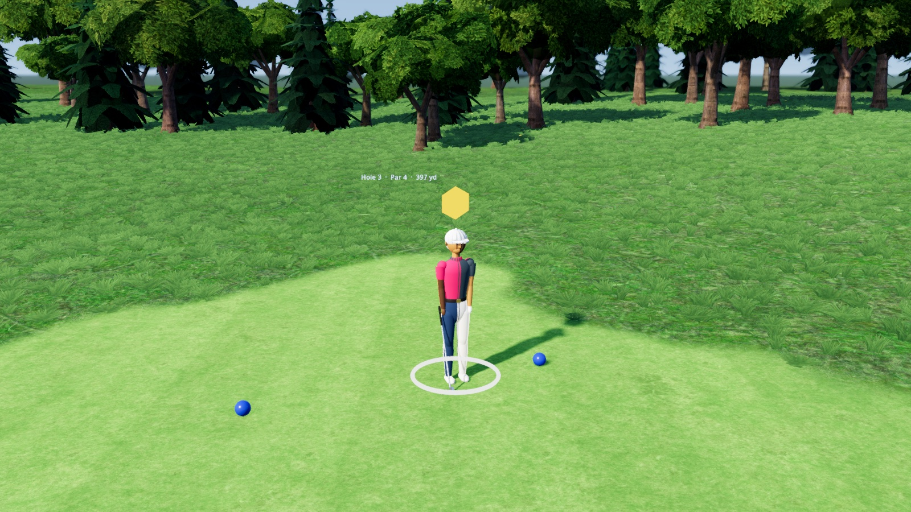
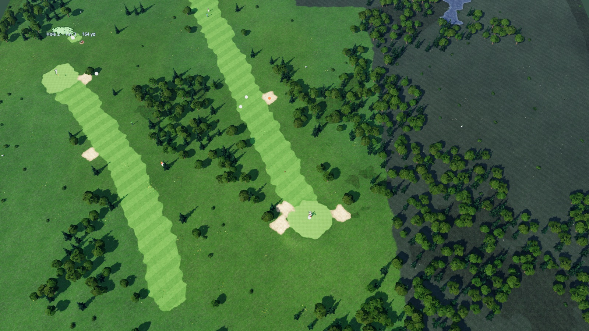
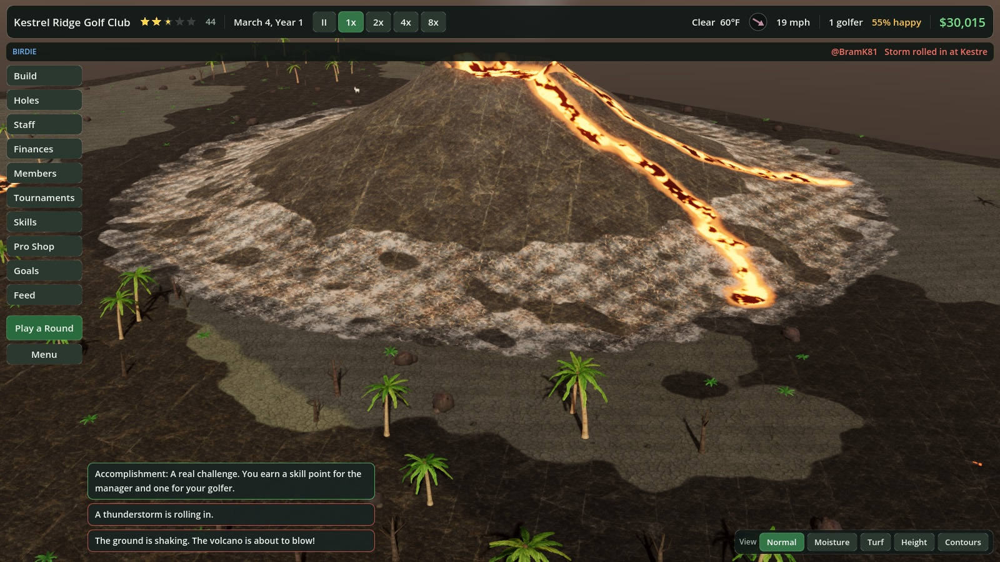
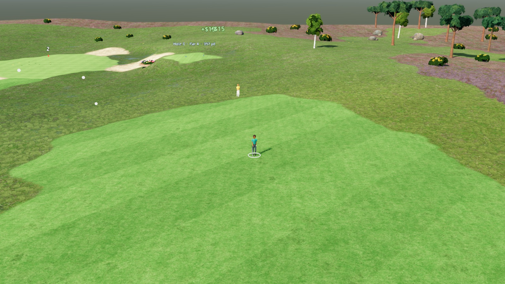
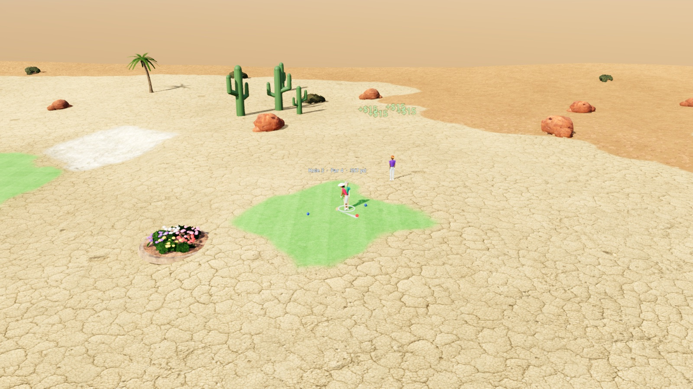
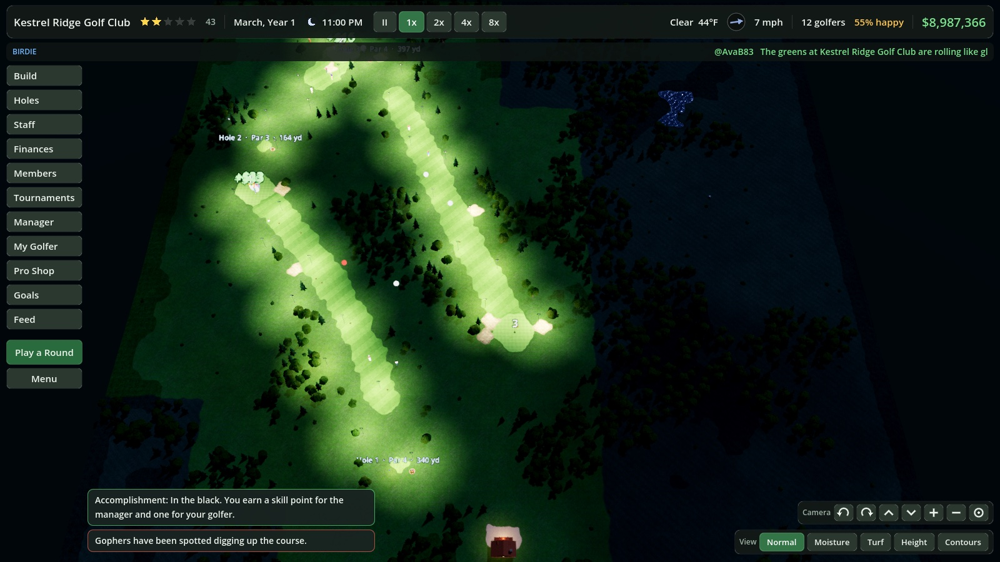
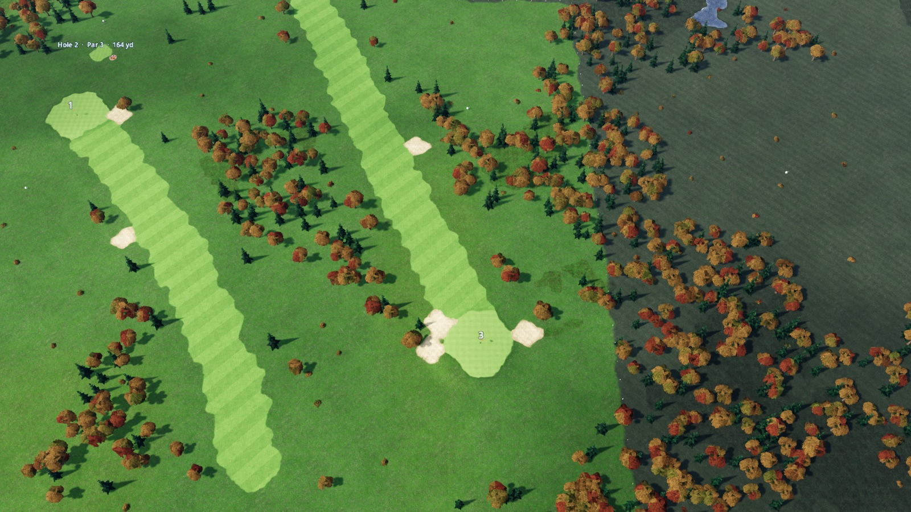
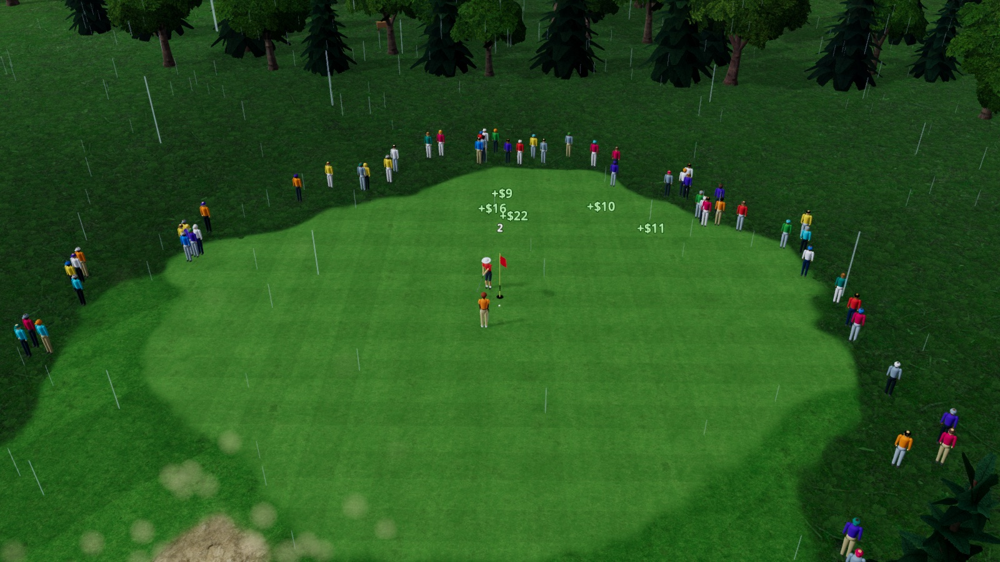
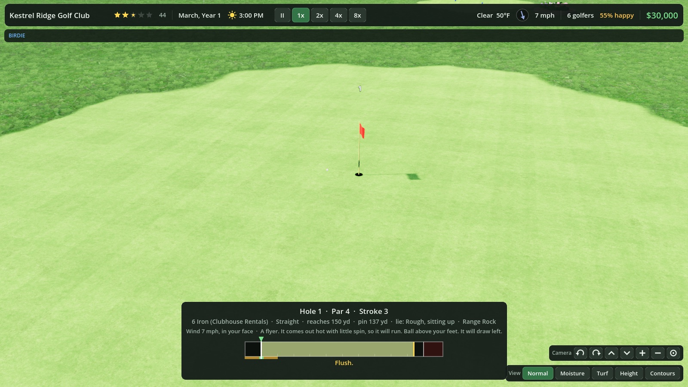

# Par & Parcel

Build a golf course. Run the club. Then go out and play the thing you built,
and discover that the bunker you put in to punish other people also works on
you.

**Download:** [macOS](https://github.com/linux4life1/par-and-parcel/releases/latest) ·
[Windows](https://github.com/linux4life1/par-and-parcel/releases/latest) ·
[Linux](https://github.com/linux4life1/par-and-parcel/releases/latest)



## The pitch

You inherit a field. There is a clubhouse on it, some trees, a pond that
nobody asked for, and thirty thousand dollars. Everything else is your
problem.

Paint a tee. Paint a green. Click one, click the other, and that is a hole.
Golfers appear from the car park with the confidence of people who have
never been asked to pay in advance, because they haven't. They play your
hole, they think about it, and on the way to the next tee they hand over
what they reckon it was worth. A good hole with a view and a bunker in an
interesting place pays like a good hole. A flat strip of grass with a flag
at the end pays like a flat strip of grass with a flag at the end. There is
no price slider in this game. The golfers *are* the price slider.

This is the whole loop, and it is a mean one. Happy golfers pay, join the
club, buy houses on your fairways and bring their friends. Unhappy golfers
pay less, and then they trample the rough and kick sand about and the weeds
notice, and weeds make golfers unhappy, and now you are hiring a second
greenkeeper at eleven at night because a man called Terry is posting about
your dandelions.

## Things that happen

A storm rolls in and the fairways go soft and nothing bounces. Night falls
and the golfers play on anyway, badly, grumbling, unless you have bought
floodlights, in which case they tell everyone it was magic. September comes
and the trees go gold. In the volcano scenario, the hazards are lava, the
insurance is void, and the mountain reserves the right to redesign hole six.

Two strangers get put in the same group and keep booking the same tee time.
Put a bench by the water and see what happens. A former tour pro turns up
hitting it sideways and swearing at ducks; if he finds his swing he offers
to teach your members for next to nothing. A critic from a golf magazine
plays twice, and the second round decides your rating. A fourteen-year-old
birdies your hardest hole and needs a tournament to enter. None of these
people care about your spreadsheet. All of them affect it.

Host a tournament and a gallery turns out, a few dozen at the club
championship and a few hundred for the big one, ringing the greens behind
the rope, following the leaders, applauding the birdies and groaning as one
when a ball finds the pond. They go home when it is over. You stay.

| | |
| --- | --- |
|  |  |
|  |  |
|  |  |
|  |  |

## Playing it yourself

When the office gets quiet, take your clubs out. The swing is the old
three-click: press to start the marker up the bar, press to set the power
where you stop it, and press once more as it comes back down to the line.
Early hooks. Late slices. Let it run past the line and you will find out
what a snap hook looks like from behind. There are no do-overs, because
there are no do-overs.

The ball knows where it is lying. From the rough it comes out hot with no
spin and runs forever. From a plugged lie in the sand it comes out angry.
Uphill it balloons, downhill it runs, ball above your feet it draws, and
the panel tells you all this before you swing so that afterwards you have
nobody to blame. The wind is stronger up high than down low, slack among
the trees, and it gusts. A high shot into a crosswind is a lesson. A punch
is the answer.

The camera follows your ball like television: along behind it as it climbs,
then a cut to the reverse angle on the green so you can watch it stop four
feet short and spin back to six. On a controller, the right stick swings:
pull back, push forward, push straight.

## MaCs CaNt GaMe

This game was designed, built, profiled and tuned on a Mac. All of it. The
trees, the ball physics, the wind, the crowds, the 120 frames a second.

The Windows and Linux builds are real and they work, and they exist because
the engine had a checkbox and we are not monsters. But if anyone ever tells
you Macs are not for gaming, you may point at this repository and make a
small noise.

## First time

Start Free Play and a coach walks you through it: paint a tee and a green,
join them, lay out the hole, watch the first golfer pay for it, put up a
drink stand, hire a greenkeeper, buy a parcel, and then go and play the
hole yourself. It gets out of your way as soon as you have done each thing,
and Menu, Tutorial brings it back.

## Installing

**macOS.** Open the disk image, drag the game into Applications, done. The
build is signed and notarized, so it opens like anything else. Apple
Silicon and Intel in one app.

**Windows.** Unzip, run the exe. It is one file with the whole game inside
it, no installer, no folder of three hundred DLLs. The first launch may get
a SmartScreen warning, because the exe is not code-signed yet: More info,
Run anyway.

**Linux.** Make the AppImage executable and run it. It wants a Vulkan
driver, which any current Mesa, AMD or NVIDIA setup already has.

Saves and settings live in the usual place for your platform and survive
updates.

## Controls

Everything works with a one-button mouse such as a Magic Mouse, a trackpad,
a wheel mouse or the keyboard. Every camera move is also a button in the
**Camera** bar at the bottom right of the screen.

**Camera**

| Action | Input |
| --- | --- |
| Move the map | Drag the ground, or W A S D, or the arrow keys |
| Zoom | Scroll or swipe, pinch, or + and - |
| Turn | Swipe sideways, Option-drag, Q and E, or right-drag |
| Tilt | Option-drag up and down, T and G, or right-drag |
| Move the map while a build tool is out | Hold Command and drag |
| Back to the usual angle | Home |
| Follow a golfer | Click them, then F |

On Windows and Linux, Option is Alt. If you would rather a swipe moved the
map than zoomed, change **A swipe or two-finger scroll** in the Menu; Shift
and swipe then zooms. The Menu also has a **Controls** card with all of this.

**Game**

| Action | Input |
| --- | --- |
| Pause | Space |
| Speed 1x, 2x, 4x, 8x | 1, 2, 3, 4 |
| Build panel | B |
| Holes and green fees | H |
| Play a round | P |
| Close panel, cancel tool, menu | Esc |
| Full screen | F11, or Control-Command-F |

**Playing a round**

| Action | Input |
| --- | --- |
| Aim | A and D (hold Shift for fine aim) |
| Change club | W and S |
| Change ball | Tab |
| Shape the shot | Q and E |
| Swing | Space or click, three times: start the marker, set the power, stop it on the line. Early hooks, late slices. |
| Quit the round | Esc |

The panel at the bottom tells you how the ball is lying, what that will do
to the shot, and how the wind bears on the line you are aiming. After the
shot it says how far the wind moved the ball. White stakes mark out of
bounds; the aiming ring turns red if the shot would finish beyond them.

**With a controller**

Any Xbox, PlayStation or Switch pad works, and can be plugged in at any
time. The left stick moves a pointer and A clicks, so everything a mouse
can do, a pad can do.

| Action | Input |
| --- | --- |
| Click; hold to paint, sculpt or drag the map | A |
| Back: put a tool away, close a panel | B |
| Turn and tilt the camera | Right stick |
| Zoom | Triggers |
| Move the map | Push the pointer against a screen edge |
| Step through the panels | Bumpers |
| Game speed; scroll a list; step through a menu | D-pad |
| Menu | Start |
| Pause | Select |
| In a round | Left stick aims, A swings (three presses), or pull the right stick back and push it forward; bumpers change club, X shot shape, Y ball, B stops the meter |

## Building from source

You need Godot 4.7. `godot --path .` runs the game from this folder.

```sh
./lint.sh        # every script parses, in seconds
./check.sh full  # the headless test suite, a few hundred checks
./perf.sh tour   # frame times in the real window
./build.sh       # export, once Godot's export templates are installed
./linux.sh       # run it on a Linux box over ssh and bring screenshots back
```

Every push runs lint and the tests on GitHub. A tag like `v1.0.0` builds the
release: the notarized macOS disk image, the Windows exe and the Linux
AppImage, attached to the GitHub release by `.github/workflows/release.yml`.
`docs/DESIGN.md` is the long version of everything above, with what is and
is not built.

## Credits

Ground, bark, stone and building textures are from
[Poly Haven](https://polyhaven.com) (CC0). The foliage is painted by
`tools/make_foliage.py`. Sound effects, ambience and voices are made by
`tools/make_sounds.py`, which needs `brew install vorbis-tools`.

Music, all CC0, from [OpenGameArt](https://opengameart.org): "Bluebonnet",
"Forget Me Not", "Catmint" and "Daisy" by Kistol; "Sunset Plains" by Yoiyami;
"Morning Sky" by Centurion_of_war; "Another August" by cynicmusic.
